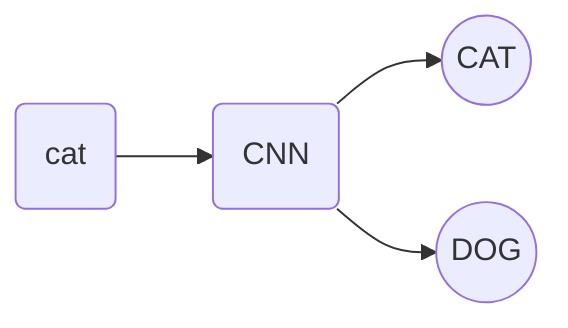
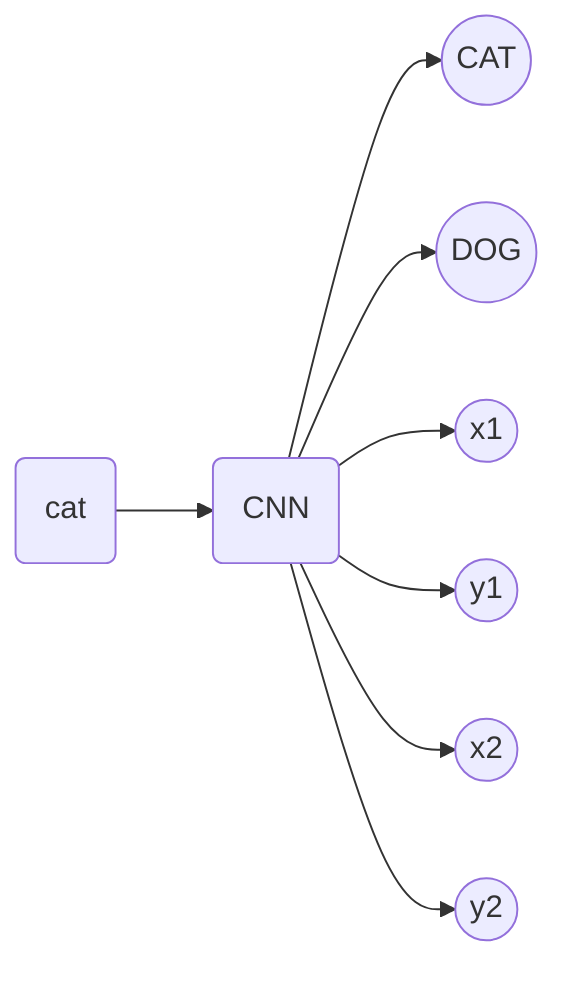

# Object detection

## Problem introduction

For the greenhouse project, the end goal is to be able to have a model to tell whether or not there is a bug in the image with 95% accuracy.

After some premilinary literature review, the problem falls into the category of tiny object detection. Typically, there are two categoty to define a tiny object, one is relative size and another is absolute size. The most popular definition is the relative size, which is defined as the # of pixels the object covers over the total number of pixels of the image is less than $\leq0.15\%$.

In order to achieve this goal, I am lacking the fundamental knowledge in the object detection, so it's what's this repository is used for.

## Overview

Here is a list of how to problem progresses

|problems|description|return type|example|
|-|-|-|-|
|`object classification`|determine whether the image belongs to this category or not.|boolean|is it a dog? yes or no.|
|`object localization`|finding what and where a `sinlge` object exists in an image|type of the object and a bounding box that bounds it|-|
|`object detection`|finding what and where `multiple objects` are in an image|-|
|`object segmentation`|find what and where the pixels the object is covering|-|-|
|`tiny object detection`|object detection but with object smaller than 0.15% of the image|-|-|

Look at the picture below for understanding

## Object classification

It is very straightforward with an cat dog problem. we just need to say it's either dog or cat. One of the other

## Object localization

For object locationalization, it basically output whether it's a dog or cat and its corresponding bounding box (4 vertices corordinates)

Localization is no biggie but how do we generalize this for multiple object in an image?

It's not that challenging since we only need to output one.

## Object detection

a bit history of evolution of object detection algorithm.

### Sliding window

The first one is the sliding window approach. Some of the main features are:
- sliding window uses square window to move around
- `Con`
	- a lot of computation (lots of redundancy computation)

To overcome this

### Regional based network

Using deterministic approach to extract "region proposals" then they resize those regions to CNN. 

算法描述:
- 输入图片
- 用deterministic algorithm (selective search algo) 在图片上画很多regional proposals, 这一步不要求region为square
- conform all images to the same size with same length and width.
- feed it into CNN

placeholder for graph

The problem made the improvements:
- 你不需要做像sliding window一样那么多的bounding boxes
- Con
	- still slow, not real time
	- non necessarily 2 step processes

## Yolo algorithm

> YOLO: you only look once! one pass solution

