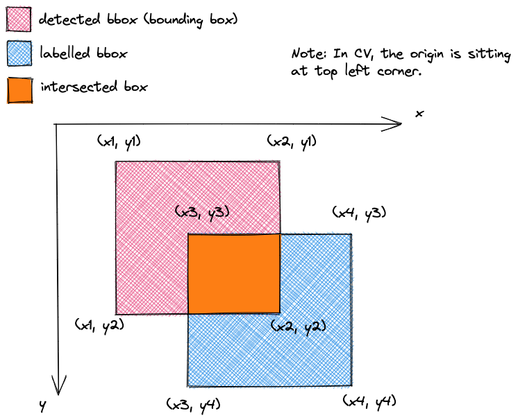

# Intersection over Union

- [Intersection over Union](#intersection-over-union)
  - [Basics](#basics)

## Basics

Intersection over union is one of the metric for object detection (classification + localization). Localization typically will output a bounding boxes in the form of vertices to you. It's illustrated in the figure below

Typically, you just need to do

